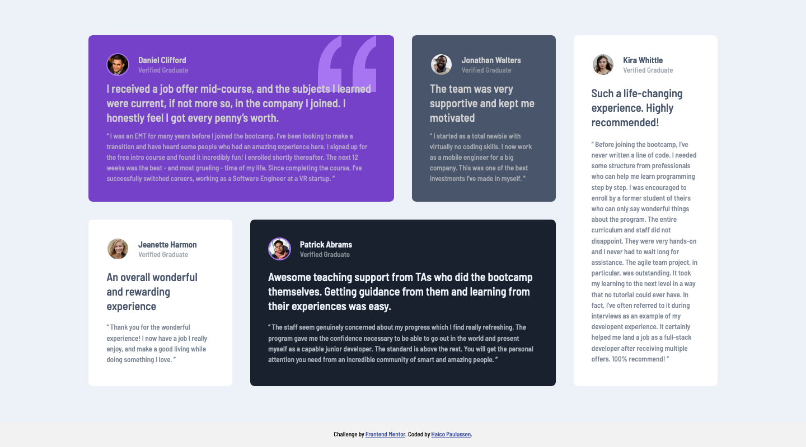

# Frontend Mentor - Testimonials grid section solution

This is a solution to the [Testimonials grid section challenge on Frontend Mentor](https://www.frontendmentor.io/challenges/testimonials-grid-section-Nnw6J7Un7). Frontend Mentor challenges help you improve your coding skills by building realistic projects. 

## Table of contents

- [Overview](#overview)
  - [The challenge](#the-challenge)
  - [Screenshot](#screenshot)
  - [Links](#links)
- [My process](#my-process)
  - [Built with](#built-with)
  - [What I learned](#what-i-learned)
  - [Continued development](#continued-development)

- [Author](#author)

## Overview

### The challenge

Users should be able to:

- View the optimal layout for the site depending on their device's screen size

### Screenshot



### Links

- Solution URL: [Front-End Mentor](https://your-solution-url.com)
- Live Site URL: [GitHub Pages](https://haico-paulussen.github.io/testimonials-CSS-Grid/)

## My process

### Built with

- Semantic HTML5 markup
- CSS Grid
- Mobile-first workflow

### What I learned

This time I tried to put my newly learned CSS Grid skills to the test with this challenge. And I'm pleased to say it went really well. I've fallen in love with CSS Grid, it made my life so much easier. Looking back to previous challenges and even futher to my old work, CSS Grid would've been so much better. But life is about learning and I'm glad I learned this.

```css
.profile {
    grid-area: 1 / 1 / 2 / 3;
    display: grid;
    grid: min-content min-content / min-content auto;
    grid-gap: 0 1rem;
}

body main {
        padding: 0;
        width: 78vw;
        max-width: 1440px;
        grid-template:
            "card1 card1 card2 card5" 1fr 
            "card3 card4 card4 card5" 1fr /1fr 1fr 1fr 1fr;
    }
```

### Continued development

So right now I learned basic HTML, CSS, Flexbox and CSS Grid. Next step for me is to start learning basic JavaScript so I can work on my long term goal: Learn VUE.js (and/or other frameworks).

## Author

- Frontend Mentor - [@Haico-Paulussen](https://www.frontendmentor.io/profile/Haico-Paulussen)
- LinkedIn - [Haico Paulussen](https://www.linkedin.com/in/haico-paulussen-160281158/)
